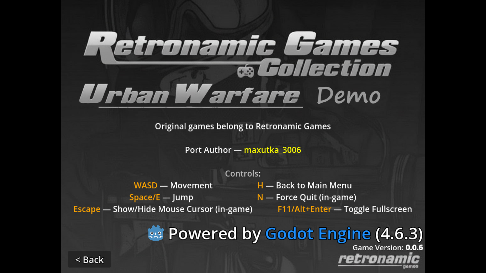
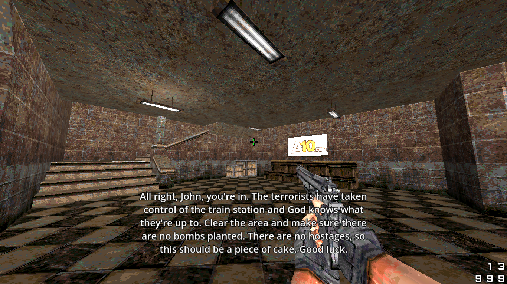
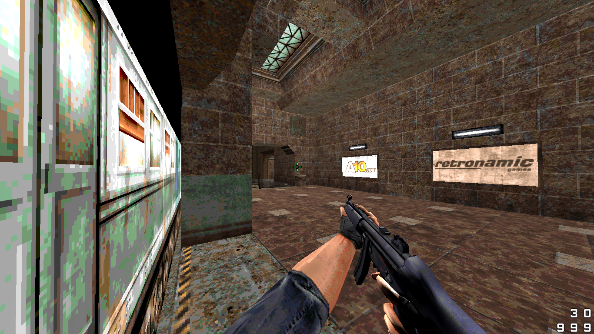

<h1 align="center">Retronamic Games Collection</h1>

A Godot Engine port of Quake mods that originally ran on Flash, created by Retronamic Games (some levels may have been developed by other contributors).

